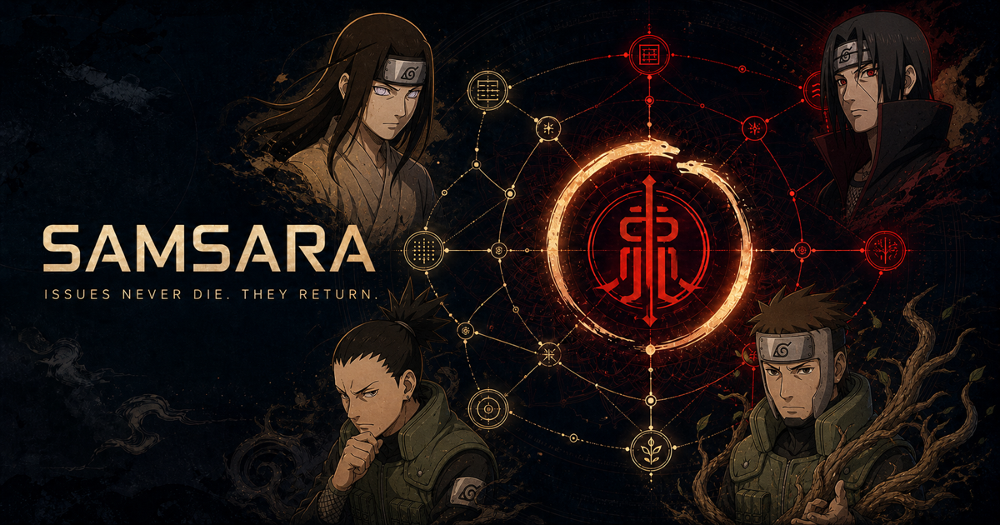

# 🌀 SAMSARA (輪廻)



> **"술법은 손끝에서 시작된다. 문제는 인(印)에서 시작된다."**
>
> **"소프트웨어에 영원한 죽음(Closed)이란 없다. 단지 다음 생(Issue)으로 전생할 뿐이다."**

`samsara`는 이슈를 **인(印)** 으로 다루는 이슈 온톨로지 하네스(Harness) 시스템입니다.
기본 운영 모드에서 개발자는 변경 작업에 앞서 인을 맺고, 그 인에 계획·증거·검토·통합 기록을 잇습니다.

---

## 제0장 · 서장 (The First Seal)

태초의 코드베이스는 고요했습니다.

그러나 사람이 무언가를 원하는 순간 — 고쳐야 할 것, 만들어야 할 것, 되돌려야 할 것을 마음에 품는 순간 — 그 열망은 형체를 얻어 세상에 떨어집니다. 우리는 그것을 **이슈**라 부르고, 이 세계에서는 **인(印)** 이라 부릅니다.

인을 맺지 않고 발동한 술법은 반드시 폭주합니다.
이유를 남기지 않은 커밋, 근거 없는 수정, 아무도 모르는 배포. 그 모든 재앙은 **결인(結印)을 생략한 대가**입니다.

`samsara`의 첫 번째 계율은 단 하나입니다.

> **변경 작업이라면 먼저 인을 맺어라. 그 다음에 술법을 써라.**

읽기 전용 조사, 새 저장소의 초기 뼈대 작업, 이미 연결된 이슈가 있는 작업은 새 인을 만들지 않습니다.
설정이 `direct` 모드이거나 저장소 성숙도 게이트가 건너뛰기를 선택한 경우에도 원래 요청을 그대로 진행합니다.

---

## 제1장 · 인(印) — 이슈의 본질

### 인이란 무엇인가

인은 티켓이 아닙니다. 인은 **권한이자 좌표이자 계약**입니다.

* **권한:** 하나의 인이 맺어지는 순간, 그 인은 코드베이스의 특정 영역을 건드릴 자격을 술자에게 부여합니다. 인이 없는 손은 코드에 닿을 수 없습니다.
* **좌표:** 인은 자신이 어떤 경락(모듈)에 닿아 있는지를 스스로 알고 있습니다. 그래서 인은 언제나 위치를 가집니다.
* **계약:** 인은 "무엇이 끝나야 이 인이 풀리는가"를 명시합니다. 조건이 채워지지 않은 인은 절대 스스로 풀리지 않습니다.

### 최초의 결인, 인(寅)

모든 이슈는 **호랑이의 인(寅)** 으로 시작됩니다.

십이지의 인(寅)은 겨울의 끝, 만물이 땅을 뚫고 나오는 절기의 인입니다. 잠들어 있던 문제가 처음으로 형체를 얻어 세상 밖으로 튀어나오는 순간의 인이기에, 이 세계의 술자들은 새로운 이슈를 열 때 반드시 이 인부터 맺습니다.

`issue-create`가 하는 일이 바로 이것입니다. 세상에 없던 인을 하나 새로 세우는 일.

### 인은 홀로 발동하지 않는다

닌자의 술법은 인 하나로 완성되지 않습니다. **인의 순서와 조합**이 술법을 정의합니다.
같은 인이라도 앞에 무엇이 오고 뒤에 무엇이 이어지느냐에 따라 전혀 다른 술법이 됩니다.

이슈도 마찬가지입니다.
`Issue-104` 하나만 보면 그것은 그저 인증 버그입니다. 그러나 그 앞에 `PR-32`가 있었고, 그 앞의 전생에 `Issue-48`이 있었음을 알게 되는 순간, 그것은 **하나의 완성된 술식**으로 읽힙니다.

그래서 이 시스템은 이슈를 낱개로 저장하지 않고, **연쇄(連鎖)** 로 저장합니다.

---

## 제2장 · 인의 연쇄 — 차크라 경락도 (Ontology)

`samsara`는 모든 인을 하나의 거대한 **경락도(Ontology Graph)** 위에 새깁니다.

경락도는 다섯 종류의 실로 인과 인을 묶습니다.

| 실 | 이름 | 의미 |
| --- | --- | --- |
| ⛓️ **선행 봉인** | `depends-on` | 앞의 인이 풀려야 착수할 수 있는 실행 의존성 |
| 🌿 **계보** | `parent-of` | 상위 인과 하위 인의 계층 관계 |
| 🪞 **겹친 인** | `duplicate-of` | 같은 문제를 가리키는 중복 관계 |
| 🩸 **혈맥** | `relates-to` | 실행 순서를 막지는 않지만 함께 읽어야 하는 관계 |
| 🕯️ **계승** | `supersedes` | 새 인이 이전 인을 대체하는 관계 |

경락도가 존재하는 이유는 단 하나입니다.

> **하나의 인을 건드리면, 어느 인이 함께 떨린다.**

닌자는 적의 급소를 찌르기 전에 경락의 흐름을 먼저 읽습니다.
술자가 `Issue-104`에 손을 대려 할 때, `issue-onboard`는 어떤 선행 인이 막고 있는지와 어떤 인이 함께 연결돼 있는지를 보여 줍니다. 실제 착수 가능 여부에는 `depends-on`만 영향을 줍니다. 모듈 정보는 각 인의 `context.components`에 근거와 함께 기록되지만, 시스템이 코드 파급 범위를 자동으로 예측하지는 않습니다.

---

## 제3장 · 윤회 — 인은 죽지 않는다

인이 풀리면(Closed) 그 인은 소멸할까요?

아닙니다. **명부(冥府)로 내려갈 뿐입니다.**

닫힌 인은 GitHub와 완전 스냅샷 속에 자신의 형상을 간직한 채 잠듭니다. 통합 뒤 검증이 실패하면 기존 인을 다시 열거나, 사용자의 선택에 따라 후속 회귀 이슈를 만듭니다. 새로운 커밋을 감지해 닫힌 인을 자동으로 깨우는 감시자는 없습니다.

그래서 이 하네스는 이슈를 '닫는 것'에 집착하지 않습니다.
**어떻게 다음 생으로 이어지는가**, 그 판단과 증거를 사람이 통제합니다.

```
                  [ 輪廻 : SAMSARA CYCLE ]

        결인(寅) ──────▶ [ 인의 발동 ]
           ▲                    │
           │                    ▼
      [ 재오픈·후속 인 ]       [ 술법의 완성 ]
      (검증 실패 시 선택)           │
           ▲                    ▼
           └─── [ 명부 (Closed) ] ◀───┘
```

---

## 제4장 · 결인의 순서 (Skills)

핵심 결인은 `issue-create → issue-start → issue-end → issue-merge` 순서로 이어집니다.
`issue-onboard`, `issue-sync`, `issue-viz`는 명부를 읽고 갱신하거나 시각화하는 보조 술식이므로 필요한 시점에 호출할 수 있습니다.
아래 **[설화]** 는 세계관을 위한 서사이며, **[술식]** 이 실제로 수행되는 동작입니다. 설화는 술식의 동작을 바꾸지 않습니다.

### 1. `issue-onboard` — 개안(開眼)

> **[설화]** 술자가 처음 이 결계에 들어설 때 치르는 의식입니다. 윤회안이 열리고, 지금 이 세계에 떠 있는 모든 인과 그 인들이 서로를 붙잡고 있는 사슬, 그리고 가장 먼저 손대야 할 인이 시야에 드러납니다. 눈을 뜨지 않은 자는 아무것도 건드릴 수 없습니다.
>
> **[술식]** 이슈 그래프와 우선순위를 확인합니다.

### 2. `issue-sync` — 명부 동기화 (冥府同期)

> **[설화]** 오로치마루의 서고로 내려가, 원격의 묘지에 잠든 인들의 명부를 현세의 기록과 대조합니다. 누가 새로 태어났고, 누가 잠들었으며, 누가 다시 눈을 떴는지. 명부가 어긋난 채로 맺은 인은 허상입니다.
>
> **[술식]** GitHub 이슈 그래프 스냅샷을 갱신합니다.

### 3. `issue-viz` — 경락도 시각화

> **[설화]** 명부에 새겨진 인과를 한눈에 읽기 위해 경락의 흐름을 화면에 펼칩니다. 어느 인이 열려 있고, 무엇이 막혀 있으며, 서로 어떤 실로 연결되는지 보드와 관계망으로 확인합니다.
>
> **[술식]** `.issue/graph.json`을 칸반·관계 연결선·상세 패널이 포함된 자체완결 `.issue/graph.html`로 렌더링합니다.

그래프를 확인할 때 `$issue-viz [--sync] [--no-open]`을 호출합니다. `--sync`는 GitHub에서 스냅샷을 다시 만들고, `--no-open`은 파일만 생성합니다.

```sh
node skills/issue-viz/scripts/issue-viz.mjs --no-open
```

### 4. `issue-create` — 결인 (結印 · 寅)

> **[설화]** 새로운 인을 세상에 세웁니다. 그러나 그 전에 반드시 명부를 뒤져야 합니다 — **이미 같은 얼굴의 인이 어딘가에서 숨 쉬고 있지는 않은가.** 중복된 인은 경락을 둘로 찢고 술법을 폭주시킵니다. 대조가 끝난 뒤에야 비로소 호랑이의 인이 맺힙니다.
>
> **[술식]** 중복을 확인한 뒤 이슈를 등록합니다.

### 5. `issue-start` — 술법 발동 (印術發動)

> **[설화]** 맺어진 인에 차크라가 흘러 들어가고, 술자는 분신을 내어 자신만의 결계(워크트리) 안으로 들어섭니다. 그곳에서 문제의 기원을 꿰뚫어 보고, 손을 대고, 자신이 무엇을 했는지에 대한 **증거를 인의 표면에 새깁니다.** 증거 없는 술법은 아무도 믿지 않습니다.
>
> **[술식]** 이슈를 분석하고 구현한 뒤, 증거를 게시합니다.

### 6. `issue-end` — 인의 해방 (解印)

> **[설화]** 술자가 스스로 술법을 끝냈다고 선언할 수는 없습니다. 오직 **심판을 통과한 인만이** 풀려나 세상 앞에 자신의 결과를 내놓을 자격을 얻습니다. 여기서 인은 봉인의 형태를 벗고, 모두가 검토할 수 있는 하나의 제안(PR)이 됩니다.
>
> **[술식]** 승인된 작업에 대해 PR을 생성합니다.

### 7. `issue-merge` — 창조재생 (創造再生)

> **[설화]** 흩어져 있던 여러 결계를 하나의 몸으로 되돌리는 최후의 술식입니다. 서로 다른 술자가 같은 경락을 건드렸다면 여기서 충돌이 터집니다. 목둔이 갈라진 줄기를 하나로 엮고, 검증이 끝나야 비로소 인은 명부로 내려가 잠듭니다. **소멸이 아니라, 잠드는 것입니다.**
>
> **[술식]** 여러 워크트리를 통합·검증하고 이슈를 종료합니다.

### 결계를 여는 준비 술식

본 술식은 아니지만, 결계에 들어서기 전 손을 씻는 절차입니다.

* `gh-setup` — GitHub CLI 설치·인증 상태를 확인합니다.
* `github-issue-pr-convention` — 저장소의 이슈·PR 관례를 스캔해 기록합니다.

---

## 제5장 · 인을 감시하는 자들 (Agents)

인은 스스로 자신을 심판하지 못합니다. 그래서 네 명의 닌자가 결계 곳곳에 서 있습니다.

### 👁️ `neji-verifier` — 휴우가 네지 (Verifier)


> **"백안에는 사각(死角)이 없다."**

`issue-create`, `issue-start`, `issue-end` 곳곳에서 짧고 명확한 판정이 필요할 때 나서는 자입니다.
네지는 저장소 전제, 중복 후보, 변경의 성격, before·after 증거의 완결성을 실제 파일과 명령 출력으로 확인합니다. 코드를 고치거나 이슈를 등록하지 않고 판정 결과만 돌려줍니다.

<br clear="all" />

### ♟️ `shikamaru-merge-analyst` — 나라 시카마루 (Merge Analyst)


> **"귀찮군… 하지만 이미 200수 앞까지 다 읽었다."**

여러 결계를 하나로 합치기 직전, 자신에게 배정된 워크트리 하나를 읽는 전략가입니다.
변경 범위, 연결 이슈, 증거, PR·CI 상태, 다른 워크트리와 겹치는 경로를 조사해 구조화된 분석을 돌려줍니다. 전체 통합 순서는 이 분석들을 받은 `issue-merge`가 세우며, 시카마루는 코드에 손대지 않습니다.

<br clear="all" />

### 🌳 `yamato-merge-resolver` — 야마토 (Merge Resolver)


> **"갈라진 것은 다시 엮으면 된다."**

시카마루의 분석을 모아 `issue-merge`가 세운 계획에서, 충돌한 코드를 실제로 엮는 손입니다.
목둔은 서로 다른 두 성질을 억지로 하나의 나무로 길러내는 술법입니다. 야마토는 충돌한 코드의 양쪽 의도를 모두 살피고, 어느 한쪽을 버리는 대신 **둘 다 살아남는 형태**로 줄기를 엮어냅니다. 그럼에도 엮이지 않는 줄기가 있다면, 그는 억지로 덮지 않고 술자를 부릅니다.

<br clear="all" />

### 🔥 `itachi-merge-critic` — 우치하 이타치 (Merge Critic)


> **"자만한 술식은 반드시 무너진다. 무너지기 전에 내가 부순다."**

병합 전에 세운 통합 계획을 깨뜨려 보는 비평가입니다.
모호한 단계, 검증되지 않은 전제, 빠진 충돌 시나리오, 되돌릴 수 없는 순서와 증거 부족을 찾아냅니다. 계획을 고쳐 쓰거나 merge·push·close를 실행하지 않으며, 문제가 없을 때만 빈 blocking 목록을 돌려줍니다.

<br clear="all" />

네 명의 닌자는 Claude와 Codex 양쪽에 같은 이름으로 서 있습니다.

```text
claude  agents/neji-verifier.md            codex  agents/neji-verifier.toml
        agents/shikamaru-merge-analyst.md         agents/shikamaru-merge-analyst.toml
        agents/yamato-merge-resolver.md           agents/yamato-merge-resolver.toml
        agents/itachi-merge-critic.md             agents/itachi-merge-critic.toml
```

---

## 제6장 · 술식의 흐름 (The Flow)

```
issue-onboard ─┐
issue-sync    ─┼─▶ issue-viz (필요 시)
                  │
                  └────────▶ issue-create → issue-start → 검토·승인 → issue-end → issue-merge
                               (결인 · 寅)    (술법 발동)    (neji)      (해인)      (창조재생)
                                                                       shikamaru
                                                                        yamato
                                                                        itachi
```

* **`issue-onboard`** 는 현재 판을 읽는 선택적 진입점이고, **`issue-sync`** 는 그래프 스냅샷을 갱신하며, **`issue-viz`** 는 그 스냅샷을 브라우저에서 읽는 보조 술식입니다.

---

## 제7장 · 인과의 서 (Karma Record)

세상에 맺힌 모든 인은 GitHub를 정본으로 삼아 `.issue/graph.json` V2 캐시에 새겨집니다.
아래는 Ajv 스키마를 통과하는 최소 형태입니다.

```json
{
  "version": 2,
  "provider": "github",
  "repository": "Mineru98/samsara",
  "updatedAt": "2026-08-26T00:00:00.000Z",
  "snapshot": {
    "status": "complete",
    "fetchedAt": "2026-08-26T00:00:00.000Z",
    "digest": "sha256:aaaaaaaaaaaaaaaaaaaaaaaaaaaaaaaaaaaaaaaaaaaaaaaaaaaaaaaaaaaaaaaa",
    "reason": null
  },
  "nodes": {
    "104": {
      "id": "github:Mineru98/samsara#104",
      "number": 104,
      "title": "토큰 갱신 실패로 인한 인증 이슈",
      "status": "open",
      "labels": ["bug"],
      "url": "https://github.com/Mineru98/samsara/issues/104",
      "context": {
        "problem": { "value": "토큰 갱신 실패", "reason": "issue body", "source": "github" },
        "outcome": { "value": "인증 유지", "reason": "issue body", "source": "github" },
        "scope": { "value": "auth", "reason": "issue body", "source": "github" },
        "acceptance": { "value": "회귀 테스트 통과", "reason": "issue body", "source": "github" },
        "result": { "value": "unknown", "reason": "작업 전", "source": "sync" },
        "components": { "value": ["AuthModule", "TokenService"], "reason": "issue body", "source": "github" },
        "decisions": { "value": "unknown", "reason": "결정 없음", "source": "sync" },
        "evidence": { "value": "unknown", "reason": "작업 전", "source": "sync" }
      },
      "provenance": {
        "url": "https://github.com/Mineru98/samsara/issues/104",
        "revision": "2026-08-26T00:00:00.000Z",
        "observedAt": "2026-08-26T00:00:00.000Z"
      }
    }
  },
  "edges": []
}
```

상태는 `open`, `plan`, `in-process`, `review`, `close` 중 하나입니다.
과거 인을 대체할 때는 `supersedes`, 단순히 함께 읽어야 할 때는 `relates-to`를 사용합니다.
이 세계에서 전생은 마법의 필드가 아니라, 승인된 관계와 사람이 남긴 증거로 추적됩니다.

---

## 제8장 · 결계의 설치 (Plugin Installation)

### Claude Code

```sh
claude plugin marketplace add Mineru98/samsara
claude plugin install samsara@samsara
```

### Codex

```sh
codex plugin marketplace add Mineru98/samsara
codex plugin add samsara@samsara
```

### Grok Build

SAMSARA는 Grok Build 공식 플러그인 형식인 `.grok-plugin/plugin.json`을 제공합니다. Grok은
플러그인의 기본 `skills/`와 `agents/` 경로에서 현재 SAMSARA의 9개 스킬과 4개 에이전트를
읽습니다. 이 저장소에는 현재 Grok 전용 commands, hooks, MCP servers, LSP servers는 없습니다.

현재 포함된 스킬은 `gh-setup`, `github-issue-pr-convention`, `issue-create`, `issue-start`,
`issue-end`, `issue-merge`, `issue-onboard`, `issue-sync`, `issue-viz`입니다.

SAMSARA의 플러그인 원본 저장소와 xAI 공식 marketplace 카탈로그 등록은 별개입니다. 이 이슈
범위에서는 `xai-org/plugin-marketplace`에 등록하는 외부 PR을 제출하지 않으므로, 카탈로그에
`samsara` 항목이 있을 때만 marketplace 이름으로 설치합니다.

```sh
grok plugin marketplace list
grok plugin marketplace update
grok plugin install samsara
grok plugin update samsara
```

카탈로그에 아직 항목이 없거나 이 저장소 원본을 직접 설치하려면 GitHub shorthand와 고정된
commit ref를 source로 넘깁니다. 아래 SHA는 `issue-viz`와 현재 9개 스킬을 포함하는 manifest
기준 커밋입니다. 문서가 자기 자신을 가리키는 순환을 피하기 위해 검증된 기준 ref를
의도적으로 고정하며, 새 버전으로 갱신할 때는 새로 검증한 전체 SHA로 교체합니다.

```sh
grok plugin install Mineru98/samsara@2466260820ba758c9b4c4b88e182e59fcc06cdcb
```

`--trust`는 manifest와 구성 요소를 검토한 뒤 비대화식 설치가 필요할 때만 선택적으로 추가하세요.
marketplace source를 새로 고칠 때는 `grok plugin marketplace update`를 먼저 실행하고, 설치된
플러그인의 이름이 `samsara`인 경우 `grok plugin update samsara`로 업데이트합니다.

별도 marketplace 카탈로그 source를 운영하는 경우에는 먼저 `grok plugin marketplace add <catalog-source>`
를 실행한 뒤 위의 `marketplace update`와 플러그인 설치 절차를 따릅니다. 이 저장소 자체는
카탈로그가 아니라 Grok plugin source입니다.

Grok Build 안에서는 `/marketplace`를 입력해 카탈로그를 열고 `i`로 플러그인을 설치할 수도
있습니다. 저장소에서 manifest와 컴포넌트 구성을 확인할 때는 다음 검증 명령을 실행합니다.

```sh
grok plugin validate .
grok inspect --json
```

`grok plugin validate .`는 현재 폴더의 manifest와 컴포넌트를 검사하고, `grok inspect --json`는
현재 활성화된 Grok 실행 환경을 진단합니다. 로컬 원본의 유효성은 첫 명령과 저장소의 JSON/path
검사 결과를 기준으로 확인하세요.

Grok Build 플러그인은 저장소 루트의 `.grok-plugin/plugin.json`과 기본 컴포넌트 디렉터리를
사용하므로 Claude Code/Codex용 플러그인 파일과 함께 설치할 수 있습니다. 공식 marketplace에
원격 소스로 등록할 때는 해당 저장소의 전체 40자 커밋 SHA를 고정해야 하며, Grok Build는
설치 시 고정된 커밋을 다시 확인합니다. SHA는 전체 소문자 40자여야 하며, 예시는
`2466260820ba758c9b4c4b88e182e59fcc06cdcb`이며 위 직접 설치 명령과 같은 기준 ref입니다.
marketplace 등록 절차는 [xAI 공식 plugin marketplace](https://github.com/xai-org/plugin-marketplace)의
PR 규칙을 따릅니다.

Claude Code, Codex, Grok Build 플러그인 버전은 모두 `v0.3.1`입니다.

공식 안내: [Grok Build Plugin Marketplace](https://x.ai/news/grok-plugin-marketplace),
[Skills, Plugins & Marketplaces](https://docs.x.ai/build/features/skills-plugins-marketplaces),
[CLI Reference](https://docs.x.ai/build/cli/reference).

`.issue/graph.json`은 GitHub에서 다시 만들 수 있는 캐시입니다. 상태 전환 뒤 수행되는 best-effort 노드 갱신이 V2 필수 문맥을 보존하지 못하면 다음 검증에서 추천을 중단하며, 이 경우 `issue-sync`로 완전 스냅샷을 다시 생성해야 합니다. v0.3.1의 phase capability bundle도 과거 `.claude`·`.codex` mirror 경로를 담고 있으므로, 루트형 플러그인 설치의 파일 목록 정본으로 사용하지 않습니다.

증거 게시 과정에서 `issue-end mirror --push`는 임시 워크트리의 증거 커밋을 `origin/<base>`에 직접 push합니다. 기본 브랜치 보호로 거부되면 `evidence/issue-<번호>` 브랜치에 `--force-with-lease`로 게시하고 그 사실을 보고합니다. Confluence가 설정된 환경에서는 같은 리포트를 외부 문서에도 게시할 수 있습니다.

---

## 종장 · 윤회의 종착지

우리는 버그를 박멸할 수 없습니다. 생성과 소멸은 시스템의 본질이기 때문입니다.

`samsara`는 인을 없애려 하지 않습니다.
인을 **읽고, 잇고, 순환시킴**으로써 완전한 안정성 — 해탈에 이르는 길을 제시할 뿐입니다.

> **"당신의 손은 오늘 어떤 인을 맺으셨습니까?"**
