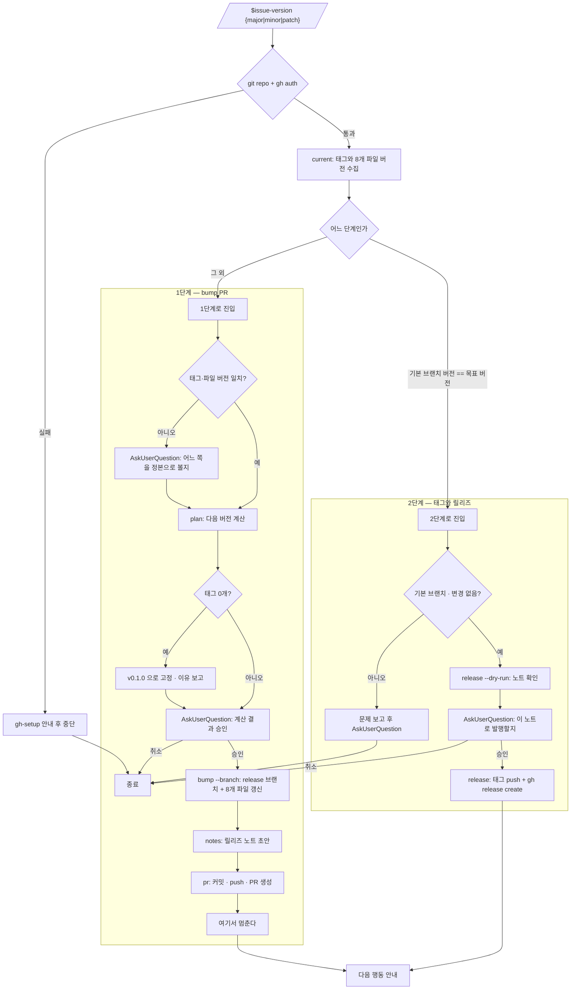

<skill>
  <purpose>
    릴리즈를 손으로 하다 생기는 두 가지 사고를 막는다.
    버전이 박힌 파일을 하나 빠뜨려 태그와 매니페스트가 어긋나는 것,
    그리고 직전 릴리즈 이후 무엇이 바뀌었는지 아무도 정리하지 않은 채 태그만 올라가는 것.
    현재 버전 판정 → 한 단계 bump → 릴리즈 노트 → 태그 → GitHub 릴리즈를 한 줄로 잇는다.
  </purpose>

  <inputs>
    <arg name="level" required="true">`major` | `minor` | `patch`. 한글로 `메이저` · `마이너` · `패치` 도 같은 뜻으로 받는다</arg>
    <arg name="--dry-run" required="false">파일·태그·릴리즈를 만들지 않고 결과만 확인한다</arg>
  </inputs>

  <preconditions>
    <item>현재 디렉터리가 git 저장소이고 `origin` 이 GitHub 저장소를 가리킨다</item>
    <item>`gh auth status` 통과. 실패하면 `gh-setup` 스킬로 먼저 끝낸다</item>
    <item>git, Node 18+</item>
  </preconditions>

  <routing>
    <always>references/version-sources.md — 버전이 박힌 파일과 형식 규약</always>
    <always>references/release-notes.md — 커밋 type 매핑과 노트 형식</always>
  </routing>

  <hard-rules>
    <rule>버전 소스 파일은 전부 함께 올린다. 하나만 올리고 끝내지 않는다.</rule>
    <rule>태그가 하나도 없으면 인자와 무관하게 `v0.1.0` 에서 시작한다. `v0.0.1` 이나 `v1.0.0` 으로 시작하지 않는다.</rule>
    <rule>태그 버전과 파일 버전이 어긋나면 bump 하지 않는다. 사용자에게 알리고 판단을 받는다.</rule>
    <rule>1단계는 PR 생성에서 멈춘다. PR 을 스스로 merge 하거나 그대로 태그로 넘어가지 않는다.</rule>
    <rule>기본 브랜치에 직접 커밋하지 않는다. bump 는 항상 `release/vX.Y.Z` 브랜치에서 한다.</rule>
    <rule>2단계는 기본 브랜치의 버전 소스가 목표 버전과 일치할 때만 진행한다. 그것이 PR merge 여부를 확인하는 유일한 신호다.</rule>
    <rule>이미 있는 태그를 덮어쓰거나 지우지 않는다.</rule>
    <rule>릴리즈 노트는 직전 태그 이후의 실제 커밋에서만 만든다. 없는 변경을 지어내지 않는다.</rule>
    <rule>사용자가 정해야 할 것은 AskUserQuestion 으로 묻는다.</rule>
  </hard-rules>

  <reporting>
    이슈·PR·릴리즈는 `[설명](링크)` 로 쓴다.
    문제가 생기면 상황 → 문제 → 멀쩡한 것 → 원인 → 선택 순서로 쉬운 말로 보고하고, 마지막은 AskUserQuestion 으로 닫는다.
  </reporting>
</skill>

# 전체 흐름



# 스크립트 경로

아래 중 **존재하는 첫 번째 경로**를 `<skill>` 로 쓴다.

```text
skills/issue-version              # 플러그인 루트 (Claude Code / Codex)
~/.claude/skills/issue-version    # 홈 설치
~/.codex/skills/issue-version     # 홈 설치
```

# 실행 순서

## 0단계 — 인자 해석과 전제 확인

```text
major | 메이저 | 매니저   →  X 자리를 올린다 (0.3.2 → 1.0.0)
minor | 마이너            →  Y 자리를 올린다 (0.3.2 → 0.4.0)
patch | 패치              →  Z 자리를 올린다 (0.3.2 → 0.3.3)
```

인자가 없거나 위 셋에 해당하지 않으면 AskUserQuestion 으로 한 번 묻는다. 임의로 `patch` 를 고르지 않는다.

```bash
git rev-parse --show-toplevel
gh auth status
```

`gh` 인증이 없으면 `gh-setup` 스킬로 끝낸 뒤 이어서 진행한다.

## 1단계 — 현재 상태 판정

```bash
node <skill>/scripts/issue-version.mjs current
```

출력에서 세 가지를 읽는다.

```text
LATEST_TAG=v0.3.2       기본 브랜치에서 도달 가능한 최신 semver 태그. 비어 있으면 태그가 없다
FILE_VERSIONS=0.3.2     버전 소스 파일들이 들고 있는 값. 쉼표로 여러 개면 파일끼리 이미 어긋난 것이다
VERSION_DRIFT=1         태그와 파일 버전이 다르다
```

`VERSION_DRIFT=1` 이면 **여기서 멈추고** AskUserQuestion 으로 묻는다. 조용히 어느 한쪽을 고르지 않는다.

```text
질문   태그(v0.3.2)와 파일 버전(0.3.1)이 다릅니다. 어느 쪽을 현재 버전으로 볼까요?
1. 태그 기준 (권장)   v0.3.2 에서 올립니다. 파일도 새 버전으로 맞춰집니다.
2. 파일 기준          0.3.1 에서 올립니다. 태그 하나를 건너뛴 셈이 됩니다.
3. 중단               먼저 손으로 맞춘 뒤 다시 부릅니다.
```

`FILE_VERSIONS` 에 값이 둘 이상이면 파일끼리 이미 깨진 것이므로, 어느 값으로 통일할지 함께 확인한다.

## 2단계 — 어느 단계인지 고른다

이 스킬은 한 릴리즈를 두 번에 나눠 진행한다. **판정 기준은 기본 브랜치의 버전 소스 값 하나뿐이다.**

```text
기본 브랜치 파일 버전 == 목표 버전   →  bump PR 이 이미 merge 됐다.  4단계(태그·릴리즈)로 간다
그 외                                →  아직 bump 전이다.            3단계(bump PR)로 간다
```

목표 버전은 `plan` 이 계산한 `NEXT_VERSION` 이다. 사용자가 이미 merge 된 상태에서 같은 명령을 다시 불렀다면
`plan` 의 결과가 아니라 **파일에 이미 들어 있는 값**이 목표 버전이므로, `current` 의 `FILE_VERSIONS` 가
최신 태그보다 높으면 그 값으로 4단계에 들어간다.

## 3단계 — bump PR (1단계)

```bash
node <skill>/scripts/issue-version.mjs plan <level>
```

```text
NEXT_VERSION=0.3.3
NEXT_TAG=v0.3.3
FIRST_RELEASE=0        1 이면 태그가 하나도 없어 v0.1.0 으로 고정된 것이다
```

`FIRST_RELEASE=1` 이면 인자를 무시하고 `v0.1.0` 이 나온다. 그 이유를 한 줄로 보고한다.

계산 결과를 AskUserQuestion 으로 승인받는다. 승인 전에 파일을 건드리지 않는다.

```bash
node <skill>/scripts/issue-version.mjs bump <level> --branch
node <skill>/scripts/issue-version.mjs notes --version v<NEXT_VERSION>
node <skill>/scripts/issue-version.mjs pr v<NEXT_VERSION>
```

`bump --branch` 가 `release/vX.Y.Z` 브랜치를 만들고 그 위에서 버전 소스 파일을 갱신한다.
`pr` 은 `chore(release): bump version to vX.Y.Z` 로 커밋하고 push 한 뒤 PR 을 만든다.

**PR 을 만들면 멈춘다.** merge 는 사람이 한다. 다음 안내만 남긴다.

```text
[#42 chore(release): bump version to v0.3.3](<PR URL>) 을 merge 한 뒤
`$issue-version <level>` 을 다시 부르면 태그와 릴리즈를 냅니다.
```

확인만 하고 싶으면 `--dry-run` 을 붙여 `bump` 까지만 돌린다. 파일도 브랜치도 만들지 않는다.

## 4단계 — 태그와 릴리즈 (2단계)

기본 브랜치를 최신으로 맞추고 시작한다.

```bash
git switch <base> && git pull --ff-only
node <skill>/scripts/issue-version.mjs release v<VERSION> --dry-run
```

`--dry-run` 이 릴리즈 노트 전문을 출력한다. 이것을 그대로 보여주고 AskUserQuestion 으로 승인받는다.
노트를 손보고 싶다면 `notes --out` 으로 파일에 뽑아 고친 뒤 `--notes-file` 로 넘긴다.

```bash
node <skill>/scripts/issue-version.mjs release v<VERSION>
```

스크립트가 순서대로 확인한다. 하나라도 어긋나면 exit 3 으로 멈추고 아무것도 만들지 않는다.

```text
태그가 이미 있는가          있으면 중단
현재 브랜치가 기본 브랜치인가  아니면 중단
커밋되지 않은 변경이 있는가   있으면 중단
파일 버전 == 목표 버전인가    아니면 중단 (= bump PR 이 아직 merge 되지 않았다)
```

태그 push 가 실패하면 방금 만든 로컬 태그를 스스로 지우고 멈춘다. 반쯤 올라간 상태를 남기지 않는다.

## 마무리 보고

1단계를 끝냈을 때.

| 항목 | 내용 |
| --- | --- |
| **단계** | 1/2 — bump PR |
| **현재 → 다음** | v0.3.2 → v0.3.3 (patch) |
| **갱신 파일** | 8개 |
| **브랜치** | `release/v0.3.3` |
| **PR** | [#42 chore(release): bump version to v0.3.3](\<PR URL\>) |
| **다음** | PR merge 후 `$issue-version patch` 재실행 |

2단계를 끝냈을 때.

| 항목 | 내용 |
| --- | --- |
| **단계** | 2/2 — 태그·릴리즈 |
| **태그** | `v0.3.3` (직전 `v0.3.2`) |
| **릴리즈** | [v0.3.3](\<릴리즈 URL\>) |
| **노트** | 커밋 \<n\>건 / 섹션 \<m\>개 |
| **다음** | \<사용자가 고른 행동\> |

값이 없는 항목은 행을 지우지 말고 `-` 로 채운다.

# 명령 요약

```text
current                        태그·8개 파일 버전 진단
plan <level>                   다음 버전 계산 (부수효과 없음)
bump <level> [--branch]        버전 소스 파일 갱신 (--dry-run · --force)
notes [--from --to --version]  릴리즈 노트 생성 (--out 으로 저장)
pr <vX.Y.Z>                    커밋 · push · PR 생성 (--dry-run)
release <vX.Y.Z>               태그 push + GitHub 릴리즈 (--dry-run · --notes-file)
```

# 검증

```bash
node --test <skill>/scripts/issue-version.test.mjs
```
