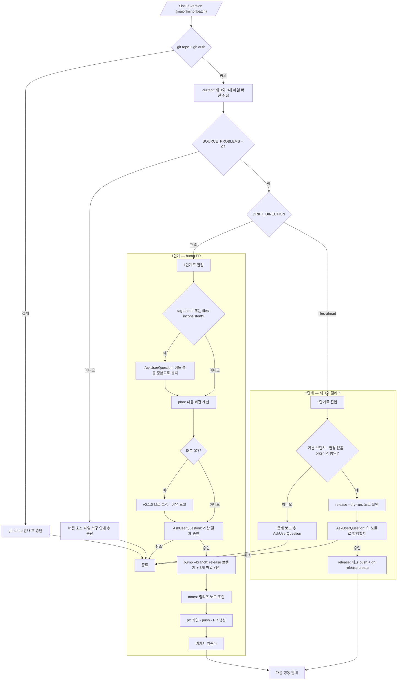

<skill>
  <purpose>
    릴리즈를 손으로 하다 생기는 두 가지 사고를 막는다.
    버전이 박힌 파일을 하나 빠뜨려 태그와 매니페스트가 어긋나는 것,
    그리고 직전 릴리즈 이후 무엇이 바뀌었는지 아무도 정리하지 않은 채 태그만 올라가는 것.
    현재 버전 판정 → 한 단계 bump → 릴리즈 노트 → 태그 → GitHub 릴리즈를 한 줄로 잇는다.
  </purpose>

  <inputs>
    <arg name="level" required="true">`major` | `minor` | `patch`. 한글로 `메이저` · `마이너` · `패치` 도 같은 뜻으로 받는다</arg>
    <arg name="--dry-run" required="false">파일·태그·릴리즈를 만들지 않고 결과만 확인한다</arg>
  </inputs>

  <preconditions>
    <item>현재 디렉터리가 git 저장소이고 `origin` 이 GitHub 저장소를 가리킨다</item>
    <item>`gh auth status` 통과. 실패하면 `gh-setup` 스킬로 먼저 끝낸다</item>
    <item>git, Node 18+</item>
  </preconditions>

  <routing>
    <always>references/version-sources.md — 버전이 박힌 파일과 형식 규약</always>
    <always>references/release-notes.md — 커밋 type 매핑과 노트 형식</always>
  </routing>

  <hard-rules>
    <rule>버전 소스 파일은 전부 함께 올린다. 하나만 올리고 끝내지 않는다.</rule>
    <rule>태그가 하나도 없으면 인자와 무관하게 `v0.1.0` 에서 시작한다. `v0.0.1` 이나 `v1.0.0` 으로 시작하지 않는다.</rule>
    <rule>태그와 파일 버전이 어긋났을 때는 `DRIFT_DIRECTION` 으로 갈린다. `tag-ahead` 와 `files-inconsistent` 는 사고이므로 사용자에게 알리고 판단을 받는다. `files-ahead` 는 bump PR 이 merge 된 정상 상태이므로 묻지 않고 2단계로 간다.</rule>
    <rule>1단계는 PR 생성에서 멈춘다. PR 을 스스로 merge 하거나 그대로 태그로 넘어가지 않는다.</rule>
    <rule>기본 브랜치에 직접 커밋하지 않는다. bump 는 항상 `release/vX.Y.Z` 브랜치에서 한다.</rule>
    <rule>2단계 진입 판정은 `current` 의 `DRIFT_DIRECTION=files-ahead` 하나로 한다. 2단계에서 발행할 버전은 `FILE_VERSIONS` 에 이미 들어 있는 값이며, 호출 인자로 다시 계산하지 않는다.</rule>
    <rule>이미 있는 태그를 덮어쓰지 않는다. 방금 자신이 만든 태그를 실패 복구로 되돌리는 것은 예외다.</rule>
    <rule>로컬 기본 브랜치가 `origin` 과 한 커밋이라도 다르면 태그를 달지 않는다. 앞서 있어도 마찬가지다.</rule>
    <rule>버전 소스 파일이 사라졌거나 JSON 이 깨졌으면(`SOURCE_PROBLEMS`) bump 도 PR 도 릴리즈도 하지 않는다.</rule>
    <rule>bump 는 전부 바꾸거나 하나도 바꾸지 않는다. 한 파일이라도 렌더에 실패하면 아무것도 쓰지 않고 멈춘다.</rule>
    <rule>원격과 같은지 확인하지 못하면 태그를 달지 않는다. 확인 불가를 통과로 취급하지 않는다.</rule>
    <rule>릴리즈 노트는 직전 태그 이후의 실제 커밋에서만 만든다. 없는 변경을 지어내지 않는다.</rule>
    <rule>사용자가 정해야 할 것은 AskUserQuestion 으로 묻는다.</rule>
  </hard-rules>

  <reporting>
    이슈·PR·릴리즈는 `[설명](링크)` 로 쓴다.
    문제가 생기면 상황 → 문제 → 멀쩡한 것 → 원인 → 선택 순서로 쉬운 말로 보고하고, 마지막은 AskUserQuestion 으로 닫는다.
  </reporting>
</skill>

# 전체 흐름



# 스크립트 경로

아래 중 **존재하는 첫 번째 경로**를 `<skill>` 로 쓴다.

```text
skills/issue-version              # 플러그인 루트 (Claude Code / Codex)
~/.claude/skills/issue-version    # 홈 설치
~/.codex/skills/issue-version     # 홈 설치
```

# 실행 순서

## 0단계 — 인자 해석과 전제 확인

```text
major | 메이저 | 매니저   →  X 자리를 올린다 (0.3.2 → 1.0.0)
minor | 마이너            →  Y 자리를 올린다 (0.3.2 → 0.4.0)
patch | 패치              →  Z 자리를 올린다 (0.3.2 → 0.3.3)
```

인자가 없거나 위 셋에 해당하지 않으면 AskUserQuestion 으로 한 번 묻는다. 임의로 `patch` 를 고르지 않는다.

```bash
git rev-parse --show-toplevel
gh auth status
```

`gh` 인증이 없으면 `gh-setup` 스킬로 끝낸 뒤 이어서 진행한다.

## 1단계 — 현재 상태 판정

```bash
node <skill>/scripts/issue-version.mjs current
```

출력에서 다섯 가지를 읽는다.

```text
LATEST_TAG=v0.3.2         기본 브랜치에서 도달 가능한 최신 semver 태그. 비어 있으면 태그가 없다
FILE_VERSIONS=0.3.2       버전 소스 파일들이 들고 있는 값
SOURCE_PROBLEMS=0         파일 누락·JSON 파싱 실패 건수
VERSION_DRIFT=0           태그와 파일 버전이 다른가
DRIFT_DIRECTION=none      어긋났다면 어느 쪽으로 어긋났는가
RELEASE_READY=0           1 이면 2단계(태그·릴리즈)로 바로 갈 상태다
```

**`SOURCE_PROBLEMS` 가 0 이 아니면 먼저 멈춘다.** 버전 소스 파일이 사라졌거나 JSON 이 깨진 것이며,
이때 `VERSION_DRIFT=0` 이 나올 수도 있으므로 drift 만 보고 넘어가면 파일 하나를 빠뜨린 채 릴리즈된다.
빠진 파일을 되살리거나 `VERSION_SOURCES` 목록을 고친 뒤 다시 부른다.

`VERSION_DRIFT=1` 은 그 자체로 사고가 아니다. **방향이 뜻을 정한다.**

| `DRIFT_DIRECTION` | 뜻 | 대응 |
| --- | --- | --- |
| `none` | 태그와 파일이 같다 | 1단계(bump PR)로 간다 |
| `no-tag` | 태그가 아직 없다 | 1단계로 간다. 첫 릴리즈면 `v0.1.0` |
| `files-ahead` | 파일이 태그보다 앞선다 = **bump PR 이 merge 됐다** | **정상이다. 묻지 말고 2단계(태그·릴리즈)로 간다** |
| `tag-ahead` | 태그만 달리고 파일이 안 고쳐졌다 | 사고다. 아래 질문을 한다 |
| `files-inconsistent` | 파일끼리 값이 다르다 | 사고다. 어느 값으로 통일할지 묻는다 |

`files-ahead` 를 질문으로 막지 않는다. 그것이 이 스킬의 정상적인 2단계 진입 상태다.

`tag-ahead` 또는 `files-inconsistent` 일 때만 **멈추고** AskUserQuestion 으로 묻는다.

```text
질문   태그(v0.3.2)가 파일 버전(0.3.1)보다 앞서 있습니다. 어느 쪽을 현재 버전으로 볼까요?
1. 태그 기준 (권장)   v0.3.2 에서 올립니다. 파일도 새 버전으로 맞춰집니다.
2. 파일 기준          0.3.1 에서 올립니다. 태그 하나를 건너뛴 셈이 됩니다.
3. 중단               먼저 손으로 맞춘 뒤 다시 부릅니다.
```

## 2단계 — 어느 단계인지 고른다

이 스킬은 한 릴리즈를 두 번에 나눠 진행한다. **판정은 `current` 의 `DRIFT_DIRECTION` 하나로 한다.**

```text
DRIFT_DIRECTION=files-ahead   →  bump PR 이 이미 merge 됐다.  4단계(태그·릴리즈)로 간다
그 외                          →  아직 bump 전이다.            3단계(bump PR)로 간다
```

각 단계의 **목표 버전은 서로 다른 출처에서 온다.** 이것을 섞으면 안 된다.

```text
3단계(bump PR)   목표 버전 = plan 이 계산한 NEXT_VERSION   (인자에 따라 달라진다)
4단계(태그·릴리즈) 목표 버전 = FILE_VERSIONS 에 이미 들어 있는 값 (인자와 무관하다)
```

4단계에서 인자를 다시 계산에 쓰지 않는다. merge 된 파일이 `0.3.3` 이면, 사용자가 `minor` 로 불렀든
`patch` 로 불렀든 낼 릴리즈는 `v0.3.3` 이다. 이미 결정된 버전을 발행하는 단계이지 새로 정하는 단계가 아니다.
인자가 파일 버전과 맞지 않으면 그 사실을 한 줄 알리고 파일 버전으로 진행한다.

## 3단계 — bump PR (1단계)

```bash
node <skill>/scripts/issue-version.mjs plan <level>
```

```text
NEXT_VERSION=0.3.3
NEXT_TAG=v0.3.3
FIRST_RELEASE=0        1 이면 태그가 하나도 없어 v0.1.0 으로 고정된 것이다
```

`FIRST_RELEASE=1` 이면 인자를 무시하고 `v0.1.0` 이 나온다. 그 이유를 한 줄로 보고한다.

계산 결과를 AskUserQuestion 으로 승인받는다. 승인 전에 파일을 건드리지 않는다.

```bash
node <skill>/scripts/issue-version.mjs bump <level> --branch
node <skill>/scripts/issue-version.mjs notes --version v<NEXT_VERSION>
node <skill>/scripts/issue-version.mjs pr v<NEXT_VERSION>
```

`bump --branch` 가 `release/vX.Y.Z` 브랜치를 만들고 그 위에서 버전 소스 파일을 갱신한다.
`pr` 은 `chore(release): bump version to vX.Y.Z` 로 커밋하고 push 한 뒤 PR 을 만든다.

**PR 을 만들면 멈춘다.** merge 는 사람이 한다. 다음 안내만 남긴다.

```text
[#42 chore(release): bump version to v0.3.3](<PR URL>) 을 merge 한 뒤
`$issue-version <level>` 을 다시 부르면 태그와 릴리즈를 냅니다.
```

확인만 하고 싶으면 `--dry-run` 을 붙여 `bump` 까지만 돌린다. 파일도 브랜치도 만들지 않는다.

## 4단계 — 태그와 릴리즈 (2단계)

기본 브랜치를 최신으로 맞추고 시작한다.

```bash
git switch <base> && git pull --ff-only
node <skill>/scripts/issue-version.mjs release v<VERSION> --dry-run
```

`--dry-run` 이 릴리즈 노트 전문을 출력한다. 이것을 그대로 보여주고 AskUserQuestion 으로 승인받는다.
노트를 손보고 싶다면 `notes --out` 으로 파일에 뽑아 고친 뒤 `--notes-file` 로 넘긴다.

```bash
node <skill>/scripts/issue-version.mjs release v<VERSION>
```

스크립트가 순서대로 확인한다. 하나라도 어긋나면 exit 3 으로 멈추고 아무것도 만들지 않는다.

```text
현재 브랜치가 기본 브랜치인가      아니면 중단
커밋되지 않은 변경이 있는가       있으면 중단
태그가 로컬에 이미 있는가         있으면 중단
태그가 원격에 이미 있는가         있으면 중단 (fetch 후 ls-remote 로 직접 확인한다)
origin/base 위치를 확인했는가     확인 못 했으면 중단 (확인 불가는 통과가 아니다)
로컬 base == origin/base 인가    아니면 중단 (앞서 있어도 중단한다)
버전 소스 파일이 온전한가         SOURCE_PROBLEMS 가 있으면 중단
파일 버전 == 목표 버전인가        아니면 중단 (= bump PR 이 아직 merge 되지 않았다)
```

`refs/remotes/origin/<base>` 는 refspec 이 없는 클론에서는 아예 만들어지지 않는다. 그 값이 비었다고
"같다" 로 넘기면 대조가 통째로 무력화되므로, `git ls-remote origin` 으로 직접 물어보고 그것마저
실패하면 막는다.

`git pull --ff-only` 는 뒤처진 경우만 맞춘다. **앞선 경우는 못 막는다.** 이 저장소는 릴리즈 직후
`chore(graph): 캐시 갱신` 같은 로컬 커밋을 만드는 습관이 있어, 그 상태로 태그를 달면 origin 에서
도달할 수 없는 커밋을 가리킨다. 그래서 스크립트가 `fetch` 후 커밋 해시를 직접 대조한다.

실패 시 되돌리는 범위는 다음과 같다.

```text
태그 push 실패        로컬 태그를 지운다
릴리즈 생성 실패      원격 태그와 로컬 태그를 모두 지운다 (RELEASE_ROLLED_BACK=1)
원격 태그 삭제 실패    로컬 태그를 남긴다 (RELEASE_ROLLED_BACK=0) — 어느 커밋에 달렸는지가 유일한 단서다
```

원격 태그 삭제가 거부되는 흔한 이유는 저장소의 **태그 보호 규칙**이다. 이때는 `git push origin :refs/tags/<tag>`
를 다시 시도해도 같은 이유로 거부되므로, 스크립트가 대신 아래를 안내한다.

```bash
gh api -X DELETE /repos/<owner>/<repo>/git/refs/tags/<tag>
```

되돌리지 않으면 그 버전 번호는 `태그가 이미 있다` 가드에 영구히 막혀 아무도 쓸 수 없게 된다.

## 마무리 보고

1단계를 끝냈을 때.

| 항목 | 내용 |
| --- | --- |
| **단계** | 1/2 — bump PR |
| **현재 → 다음** | v0.3.2 → v0.3.3 (patch) |
| **갱신 파일** | 8개 |
| **브랜치** | `release/v0.3.3` |
| **PR** | [#42 chore(release): bump version to v0.3.3](\<PR URL\>) |
| **다음** | PR merge 후 `$issue-version patch` 재실행 |

2단계를 끝냈을 때.

| 항목 | 내용 |
| --- | --- |
| **단계** | 2/2 — 태그·릴리즈 |
| **태그** | `v0.3.3` (직전 `v0.3.2`) |
| **릴리즈** | [v0.3.3](\<릴리즈 URL\>) |
| **노트** | 커밋 \<n\>건 / 섹션 \<m\>개 |
| **다음** | \<사용자가 고른 행동\> |

값이 없는 항목은 행을 지우지 말고 `-` 로 채운다.

# 명령 요약

```text
current                        태그·8개 파일 버전 진단
plan <level>                   다음 버전 계산 (부수효과 없음)
bump <level> [--branch]        버전 소스 파일 갱신 (--dry-run · --force)
notes [--from --to --version]  릴리즈 노트 생성 (--out 으로 저장)
pr <vX.Y.Z>                    커밋 · push · PR 생성 (--dry-run)
release <vX.Y.Z>               태그 push + GitHub 릴리즈 (--dry-run · --notes-file)
```

# 검증

```bash
node --test <skill>/scripts/issue-version.test.mjs
```
